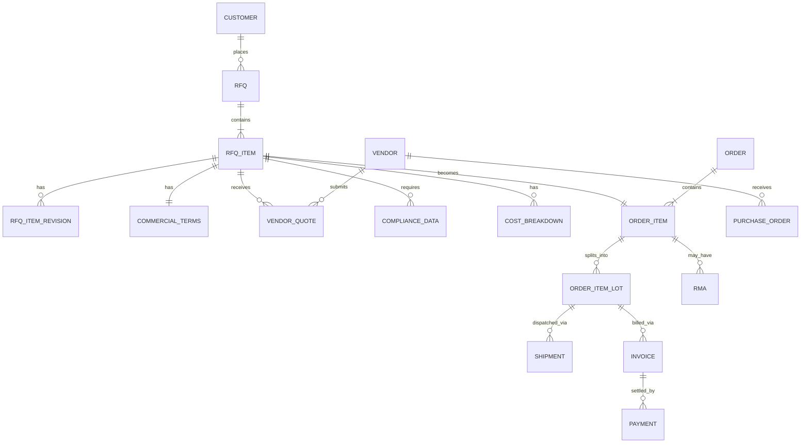
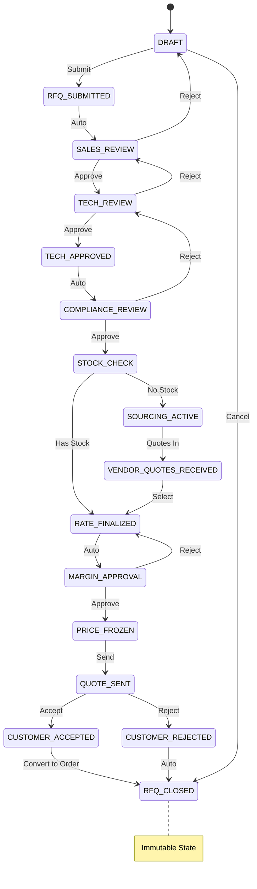
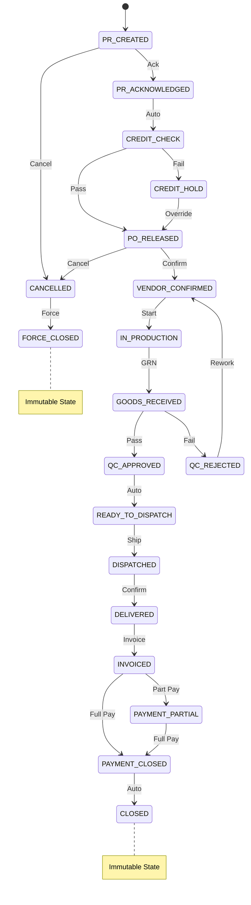

# 📘 ENTERPRISE B2B TRADE & OPERATIONS OS
## FINAL ABSOLUTE PRD — v2.0
### (Item-Level, Audit-Safe, Real-World Trading System)

---

# PART I: STRATEGIC FOUNDATION

## 1. SYSTEM PURPOSE & NON-NEGOTIABLE PHILOSOPHY

### 1.1 Purpose

Design and implement a **single enterprise operating system** for a trading company that:

- Trades any kind of product (industrial, commodity, machinery, chemicals, FMCG, custom goods)
- Operates domestically and internationally
- Handles **RFQ → Quote → Order → Purchase → Fulfillment → Finance → Closure**
- Remains stable under urgency, disputes, audits, failures, and growth

### 1.2 Absolute Design Principles

> [!CAUTION]
> These are **system laws**, not preferences. Violation invalidates production readiness.

| Principle | Enforcement |
|-----------|-------------|
| `RFQ_ITEM` / `ORDER_ITEM` is the **ONLY** workflow entity | DB constraints, API validation |
| RFQ Header / Order Header are containers only | No header-level workflow actions |
| No header-level approvals, pricing, sourcing, execution | Schema enforcement |
| Every workflow action occurs **only at item level** | State machine enforcement |
| RFQ → Order is a **state transition**, never duplication | Foreign key lineage |
| System is **append-only** (no overwrite, no delete) | Soft-delete flags, audit triggers |
| Every action is attributed, timestamped, reason-coded | Mandatory audit columns |
| Urgency handled only via **explicit override states** | Approval workflow required |
| Quantity may split internally, but ownership stays item-level | `ORDER_ITEM_LOT` entity |
| Once `CLOSED` / `FORCE_CLOSED`, data is **immutable forever** | Database triggers |

### 1.3 Success Criteria

| Metric | Target | Measurement |
|--------|--------|-------------|
| System Uptime | 99.9% | Monthly SLA report |
| Transaction Latency (P95) | < 500ms | APM monitoring |
| Audit Query Response | < 2s for 5-year range | Performance testing |
| Zero Data Loss | 100% | Backup verification |
| Compliance Score | 100% on internal audit | Quarterly audit |

---

## 2. CORE ENTITIES (CANONICAL DATA MODEL)

### 2.1 Entity Relationship Diagram



### 2.2 Primary Entities (Exhaustive)

```
ORGANIZATION (Multi-tenant root)
├── LEGAL_ENTITY (Company/Branch)
├── CUSTOMER
│   ├── CUSTOMER_CONTACT
│   └── CUSTOMER_CREDIT_PROFILE
├── VENDOR
│   ├── VENDOR_CONTACT
│   ├── VENDOR_CERTIFICATE
│   └── VENDOR_RATING
├── PRODUCT
│   ├── PRODUCT_SPECIFICATION
│   ├── PRODUCT_CATEGORY
│   └── PRODUCT_PRICING_HISTORY
│
├── RFQ (Header/Container)
│   └── RFQ_ITEM (Workflow Entity) ★
│       ├── RFQ_ITEM_REVISION
│       ├── COMMERCIAL_TERMS
│       ├── COMPLIANCE_DATA
│       ├── COST_BREAKDOWN
│       ├── VENDOR_QUOTE
│       │   └── VENDOR_QUOTE_LINE
│       └── ITEM_AUDIT_LOG
│
├── ORDER (Header/Container)
│   └── ORDER_ITEM (Workflow Entity) ★
│       ├── ORDER_ITEM_LOT
│       │   ├── LOT_INSPECTION
│       │   └── LOT_MOVEMENT
│       ├── PURCHASE_ORDER
│       │   └── PO_LINE
│       ├── SHIPMENT
│       │   └── SHIPMENT_DOCUMENT
│       ├── GOODS_RECEIPT_NOTE
│       ├── INVOICE
│       │   └── INVOICE_LINE
│       ├── PAYMENT
│       ├── RMA
│       │   └── RMA_LINE
│       └── ITEM_AUDIT_LOG
│
└── SYSTEM
    ├── USER
    ├── ROLE
    ├── PERMISSION
    ├── SLA_RULE
    ├── NOTIFICATION_TEMPLATE
    └── SYSTEM_CONFIG
```

> [!IMPORTANT]
> No other workflow entities are allowed. Any new requirement must map to existing entities.

---

# PART II: SYSTEM ENGINES (COMPLETE SPECIFICATION)

## 3. ENGINE MANIFEST

> [!WARNING]
> If even **one engine** is missing or incomplete → system is NOT production-ready.

### 3.1 Engine Checklist

| # | Engine Name | Status | Priority |
|---|-------------|--------|----------|
| 1 | Item Workflow State Machine | Required | P0 |
| 2 | Role & Permission Engine | Required | P0 |
| 3 | Revision Governance Engine | Required | P0 |
| 4 | SLA & Escalation Engine | Required | P0 |
| 5 | Exception & Risk Engine | Required | P0 |
| 6 | Vendor Intelligence Engine | Required | P1 |
| 7 | Audit & Compliance Engine | Required | P0 |
| 8 | Notification & Alert Engine | Required | P0 |
| 9 | Item-Level Reporting & BI Engine | Required | P1 |
| 10 | Commercial Terms Engine | Required | P0 |
| 11 | Credit & Financial Risk Engine | Required | P0 |
| 12 | Compliance & Trade Regulation Engine | Required | P0 |
| 13 | Change Request (CR) Engine | Required | P1 |
| 14 | Master Data Governance Engine | Required | P0 |
| 15 | Quantity Fulfillment Engine | Required | P0 |
| 16 | Tax & Duty Engine | Required | P0 |
| 17 | Returns / RMA Engine | Required | P1 |
| 18 | Multi-Entity & Legal Structure Engine | Required | P0 |
| 19 | Data Lifecycle & Archival Engine | Required | P1 |
| 20 | Human-Error Guardrail Engine | Required | P0 |
| 21 | Multi-Currency & FX Engine | Required | P0 |
| 22 | Quantity Constraint Engine (MOQ/Pack/Tolerance) | Required | P0 |
| 23 | Scheduled / Blanket Order Engine | Required | P1 |
| 24 | Cost Forensics Engine | Required | P1 |
| 25 | System Governance & Admin Engine | Required | P0 |
| 26 | Disaster Recovery & Legal Export Engine | Required | P0 |
| 27 | External Accounting Integration Engine (Tally) | Required | P1 |

### 3.2 Engine Specifications

#### Engine 1: Item Workflow State Machine

```typescript
interface StateTransition {
  from: RfqItemState | OrderItemState;
  to: RfqItemState | OrderItemState;
  allowedRoles: Role[];
  requiredFields: string[];
  validations: ValidationRule[];
  sideEffects: SideEffect[];
  auditReason: boolean; // Must provide reason
}

// Example transition
const SALES_REVIEW_TO_TECH_REVIEW: StateTransition = {
  from: 'SALES_REVIEW',
  to: 'TECH_REVIEW',
  allowedRoles: ['SALES_EXECUTIVE', 'SALES_MANAGER'],
  requiredFields: ['product_id', 'quantity', 'target_price'],
  validations: [
    { type: 'PRODUCT_ACTIVE', message: 'Product must be active' },
    { type: 'QUANTITY_POSITIVE', message: 'Quantity must be > 0' },
  ],
  sideEffects: [
    { type: 'NOTIFY', targets: ['TECH_ENGINEER'] },
    { type: 'START_SLA', duration: '24h' },
  ],
  auditReason: false,
};
```

#### Engine 7: Audit & Compliance Engine

```sql
-- Every table must have these columns
CREATE TABLE example_table (
  -- ... business columns ...
  
  -- Audit columns (MANDATORY)
  created_at TIMESTAMPTZ NOT NULL DEFAULT NOW(),
  created_by UUID NOT NULL REFERENCES users(id),
  updated_at TIMESTAMPTZ NOT NULL DEFAULT NOW(),
  updated_by UUID NOT NULL REFERENCES users(id),
  version INTEGER NOT NULL DEFAULT 1,
  is_deleted BOOLEAN NOT NULL DEFAULT FALSE,
  deleted_at TIMESTAMPTZ,
  deleted_by UUID REFERENCES users(id),
  deletion_reason TEXT
);

-- Audit log trigger (MANDATORY for all workflow tables)
CREATE OR REPLACE FUNCTION audit_log_trigger()
RETURNS TRIGGER AS $$
BEGIN
  INSERT INTO audit_log (
    table_name, record_id, action, old_data, new_data,
    user_id, timestamp, ip_address, user_agent
  ) VALUES (
    TG_TABLE_NAME, NEW.id, TG_OP, 
    row_to_json(OLD), row_to_json(NEW),
    current_setting('app.current_user_id')::uuid,
    NOW(),
    current_setting('app.client_ip'),
    current_setting('app.user_agent')
  );
  RETURN NEW;
END;
$$ LANGUAGE plpgsql;
```

---

## 4. GLOBAL ITEM STATE MACHINE

### 4.1 RFQ_ITEM States (Complete)



### 4.2 ORDER_ITEM States (Complete)



### 4.3 State Transition Matrix (Database Constraint)

```sql
CREATE TABLE state_transitions (
  id UUID PRIMARY KEY DEFAULT gen_random_uuid(),
  entity_type TEXT NOT NULL CHECK (entity_type IN ('RFQ_ITEM', 'ORDER_ITEM')),
  from_state TEXT NOT NULL,
  to_state TEXT NOT NULL,
  allowed_roles TEXT[] NOT NULL,
  requires_reason BOOLEAN DEFAULT FALSE,
  requires_approval BOOLEAN DEFAULT FALSE,
  auto_transition BOOLEAN DEFAULT FALSE,
  sla_hours INTEGER,
  
  UNIQUE(entity_type, from_state, to_state)
);

-- Enforce valid transitions at API level
CREATE OR REPLACE FUNCTION validate_state_transition(
  p_entity_type TEXT,
  p_from_state TEXT,
  p_to_state TEXT,
  p_user_role TEXT
) RETURNS BOOLEAN AS $$
BEGIN
  RETURN EXISTS (
    SELECT 1 FROM state_transitions
    WHERE entity_type = p_entity_type
      AND from_state = p_from_state
      AND to_state = p_to_state
      AND p_user_role = ANY(allowed_roles)
  );
END;
$$ LANGUAGE plpgsql;
```

---

## 5. ITEM STATE OWNERSHIP MATRIX

| State | Owner Role | SLA | Escalation To |
|-------|------------|-----|---------------|
| `RFQ_SUBMITTED` | Sales Executive | 2h | Sales Manager |
| `SALES_REVIEW` | Sales Executive | 4h | Sales Manager |
| `TECH_REVIEW` | Technical Engineer | 24h | Tech Lead |
| `COMPLIANCE_REVIEW` | Compliance Officer | 24h | Compliance Manager |
| `SOURCING_ACTIVE` | Sourcing Engineer | 48h | Purchase Manager |
| `VENDOR_QUOTES_RECEIVED` | Sourcing Engineer | 24h | Purchase Manager |
| `RATE_FINALIZED` | Purchase Manager | 12h | Director |
| `MARGIN_APPROVAL` | Director / COE | 24h | MD |
| `QUOTE_SENT` | Sales Executive | - | - |
| `PR_CREATED` | Sales Executive | 4h | Sales Manager |
| `CREDIT_CHECK` | Finance Officer | 4h | Finance Manager |
| `PO_RELEASED` | Purchase Engineer | 12h | Purchase Manager |
| `VENDOR_CONFIRMED` | Vendor (External) | 48h | Purchase Manager |
| `GOODS_RECEIVED` | Warehouse Executive | 24h | Warehouse Manager |
| `QC_APPROVED` | QC Engineer | 24h | QC Manager |
| `DISPATCHED` | Logistics Executive | 24h | Logistics Manager |
| `INVOICED` | Finance Executive | 24h | Finance Manager |
| `CLOSED` / `FORCE_CLOSED` | System | - | - |

---

## 6. REVISION GOVERNANCE

### 6.1 Revision Rules Matrix

| Stage | Revision Allowed | Rule | Approval Required |
|-------|-----------------|------|-------------------|
| Before `TECH_APPROVED` | ✅ | Direct overwrite | No |
| After `TECH_APPROVED` | ✅ | New `RFQ_ITEM_REVISION` | Yes (Tech Lead) |
| After `PRICE_FROZEN` | ⚠️ | New revision + Director approval | Yes (Director) |
| After `QUOTE_SENT` | ⚠️ | Customer must re-accept | Yes (Customer) |
| After `PO_RELEASED` | ❌ | New RFQ required | N/A |
| After `CLOSED` | ❌ | Immutable forever | N/A |

### 6.2 Revision Data Model

```sql
CREATE TABLE rfq_item_revisions (
  id UUID PRIMARY KEY DEFAULT gen_random_uuid(),
  rfq_item_id UUID NOT NULL REFERENCES rfq_items(id),
  revision_number INTEGER NOT NULL,
  
  -- Snapshot of item data at revision time
  product_id UUID NOT NULL,
  quantity DECIMAL(15,4) NOT NULL,
  unit_of_measure TEXT NOT NULL,
  specifications JSONB,
  target_price DECIMAL(15,4),
  currency TEXT NOT NULL,
  
  -- Revision metadata
  revision_reason TEXT NOT NULL,
  approved_by UUID REFERENCES users(id),
  approved_at TIMESTAMPTZ,
  
  -- Audit
  created_at TIMESTAMPTZ NOT NULL DEFAULT NOW(),
  created_by UUID NOT NULL REFERENCES users(id),
  
  UNIQUE(rfq_item_id, revision_number)
);

-- Orders reference a specific frozen revision
ALTER TABLE order_items ADD COLUMN 
  rfq_item_revision_id UUID REFERENCES rfq_item_revisions(id);
```

---

## 7. SLA, AUTO-EXPIRY & AUTO-CLOSE

### 7.1 SLA Configuration

```sql
CREATE TABLE sla_rules (
  id UUID PRIMARY KEY DEFAULT gen_random_uuid(),
  entity_type TEXT NOT NULL,
  state TEXT NOT NULL,
  sla_duration INTERVAL NOT NULL,
  warning_threshold INTERVAL NOT NULL, -- e.g., 80% of SLA
  escalation_role TEXT NOT NULL,
  auto_action TEXT, -- 'ESCALATE', 'AUTO_CLOSE', 'AT_RISK'
  
  UNIQUE(entity_type, state)
);

-- Seed data
INSERT INTO sla_rules VALUES
  (gen_random_uuid(), 'RFQ_ITEM', 'SALES_REVIEW', '4 hours', '3 hours', 'SALES_MANAGER', 'ESCALATE'),
  (gen_random_uuid(), 'RFQ_ITEM', 'TECH_REVIEW', '24 hours', '20 hours', 'TECH_LEAD', 'ESCALATE'),
  (gen_random_uuid(), 'RFQ_ITEM', 'SOURCING_ACTIVE', '48 hours', '40 hours', 'PURCHASE_MANAGER', 'ESCALATE'),
  (gen_random_uuid(), 'ORDER_ITEM', 'VENDOR_CONFIRMED', '48 hours', '40 hours', 'PURCHASE_MANAGER', 'AT_RISK'),
  (gen_random_uuid(), 'ORDER_ITEM', 'QC_APPROVED', '24 hours', '20 hours', 'QC_MANAGER', 'ESCALATE');
```

### 7.2 Auto-Close Rules

| Condition | Action | Reversible By |
|-----------|--------|---------------|
| RFQ idle > 30 days | `RFQ_CLOSED (AUTO)` | Sales Manager |
| Quote expired | `RFQ_CLOSED (EXPIRED)` | Director |
| PO unconfirmed > 7 days | Mark `AT_RISK` | Purchase Manager |
| Delivery overdue > 14 days | Mark `LOGISTICS_DELAY` | Logistics Manager |

### 7.3 SLA Monitoring Cron Job

```typescript
// Runs every 15 minutes
async function checkSlaBreaches() {
  const breaches = await db.query(`
    SELECT i.*, s.sla_duration, s.escalation_role
    FROM rfq_items i
    JOIN sla_rules s ON s.entity_type = 'RFQ_ITEM' AND s.state = i.state
    WHERE i.state_entered_at + s.sla_duration < NOW()
      AND i.sla_breached = FALSE
  `);
  
  for (const breach of breaches) {
    await markSlaBreach(breach.id);
    await notifyEscalation(breach.id, breach.escalation_role);
    await createAuditLog(breach.id, 'SLA_BREACH', { sla_duration: breach.sla_duration });
  }
}
```

---

## 8. COMMERCIAL TERMS ENGINE

### 8.1 Commercial Terms Data Model

```sql
CREATE TABLE commercial_terms (
  id UUID PRIMARY KEY DEFAULT gen_random_uuid(),
  rfq_item_id UUID UNIQUE REFERENCES rfq_items(id),
  
  -- Incoterms
  incoterm TEXT NOT NULL CHECK (incoterm IN (
    'EXW', 'FCA', 'CPT', 'CIP', 'DAP', 'DPU', 'DDP',
    'FAS', 'FOB', 'CFR', 'CIF'
  )),
  incoterm_location TEXT,
  
  -- Payment Terms
  payment_terms JSONB NOT NULL, -- { advance_pct: 30, balance_days: 45 }
  credit_days INTEGER,
  payment_currency TEXT NOT NULL,
  
  -- Validity
  quote_validity_days INTEGER NOT NULL DEFAULT 30,
  quote_valid_until DATE,
  
  -- Warranty
  warranty_months INTEGER,
  warranty_scope TEXT, -- 'PARTS_ONLY', 'PARTS_AND_LABOR', 'FULL'
  warranty_exclusions TEXT,
  
  -- Penalties
  penalty_clauses JSONB, -- [{ type: 'LATE_DELIVERY', pct_per_week: 1, max_pct: 10 }]
  
  -- Lock status
  is_frozen BOOLEAN NOT NULL DEFAULT FALSE,
  frozen_at TIMESTAMPTZ,
  frozen_by UUID REFERENCES users(id),
  
  -- Audit
  created_at TIMESTAMPTZ NOT NULL DEFAULT NOW(),
  updated_at TIMESTAMPTZ NOT NULL DEFAULT NOW()
);

-- Freeze commercial terms when PRICE_FROZEN
CREATE OR REPLACE FUNCTION freeze_commercial_terms()
RETURNS TRIGGER AS $$
BEGIN
  IF NEW.state = 'PRICE_FROZEN' AND OLD.state != 'PRICE_FROZEN' THEN
    UPDATE commercial_terms 
    SET is_frozen = TRUE, frozen_at = NOW(), frozen_by = NEW.updated_by
    WHERE rfq_item_id = NEW.id;
  END IF;
  RETURN NEW;
END;
$$ LANGUAGE plpgsql;
```

---

## 9. CREDIT, FX, TAX & DUTY

### 9.1 Credit Engine

```sql
CREATE TABLE customer_credit_profiles (
  id UUID PRIMARY KEY DEFAULT gen_random_uuid(),
  customer_id UUID NOT NULL REFERENCES customers(id),
  legal_entity_id UUID NOT NULL REFERENCES legal_entities(id),
  
  credit_limit DECIMAL(15,2) NOT NULL,
  credit_currency TEXT NOT NULL DEFAULT 'INR',
  credit_days_allowed INTEGER NOT NULL DEFAULT 30,
  
  current_exposure DECIMAL(15,2) NOT NULL DEFAULT 0,
  current_overdue DECIMAL(15,2) NOT NULL DEFAULT 0,
  
  risk_category TEXT CHECK (risk_category IN ('LOW', 'MEDIUM', 'HIGH', 'BLOCKED')),
  last_reviewed_at TIMESTAMPTZ,
  reviewed_by UUID REFERENCES users(id),
  
  UNIQUE(customer_id, legal_entity_id)
);

-- Credit check function
CREATE OR REPLACE FUNCTION check_credit_available(
  p_customer_id UUID,
  p_legal_entity_id UUID,
  p_amount DECIMAL
) RETURNS TABLE(allowed BOOLEAN, available DECIMAL, message TEXT) AS $$
DECLARE
  v_profile customer_credit_profiles%ROWTYPE;
BEGIN
  SELECT * INTO v_profile 
  FROM customer_credit_profiles 
  WHERE customer_id = p_customer_id AND legal_entity_id = p_legal_entity_id;
  
  IF v_profile IS NULL THEN
    RETURN QUERY SELECT FALSE, 0::DECIMAL, 'No credit profile found';
    RETURN;
  END IF;
  
  IF v_profile.risk_category = 'BLOCKED' THEN
    RETURN QUERY SELECT FALSE, 0::DECIMAL, 'Customer is blocked';
    RETURN;
  END IF;
  
  IF v_profile.current_exposure + p_amount > v_profile.credit_limit THEN
    RETURN QUERY SELECT FALSE, 
      v_profile.credit_limit - v_profile.current_exposure,
      'Insufficient credit limit';
    RETURN;
  END IF;
  
  RETURN QUERY SELECT TRUE, 
    v_profile.credit_limit - v_profile.current_exposure - p_amount,
    'Credit available';
END;
$$ LANGUAGE plpgsql;
```

### 9.2 FX Engine

```sql
CREATE TABLE fx_rates (
  id UUID PRIMARY KEY DEFAULT gen_random_uuid(),
  from_currency TEXT NOT NULL,
  to_currency TEXT NOT NULL,
  rate DECIMAL(20,10) NOT NULL,
  rate_date DATE NOT NULL,
  source TEXT NOT NULL, -- 'RBI', 'OANDA', 'MANUAL'
  
  UNIQUE(from_currency, to_currency, rate_date)
);

CREATE TABLE order_item_fx (
  id UUID PRIMARY KEY DEFAULT gen_random_uuid(),
  order_item_id UUID NOT NULL REFERENCES order_items(id),
  
  vendor_currency TEXT NOT NULL,
  customer_currency TEXT NOT NULL,
  booking_rate DECIMAL(20,10),
  booking_rate_date DATE,
  settlement_rate DECIMAL(20,10),
  settlement_rate_date DATE,
  
  fx_gain_loss DECIMAL(15,2),
  fx_gain_loss_posted BOOLEAN DEFAULT FALSE
);
```

### 9.3 Tax & Duty Engine

```sql
CREATE TABLE order_item_tax (
  id UUID PRIMARY KEY DEFAULT gen_random_uuid(),
  order_item_id UUID NOT NULL REFERENCES order_items(id),
  
  -- Product classification
  hs_code TEXT NOT NULL,
  country_of_origin TEXT NOT NULL,
  
  -- Duties (for imports)
  basic_duty_pct DECIMAL(5,2) DEFAULT 0,
  additional_duty_pct DECIMAL(5,2) DEFAULT 0,
  anti_dumping_duty DECIMAL(15,2) DEFAULT 0,
  
  -- GST (India)
  cgst_pct DECIMAL(5,2) DEFAULT 0,
  sgst_pct DECIMAL(5,2) DEFAULT 0,
  igst_pct DECIMAL(5,2) DEFAULT 0,
  
  -- Computed
  assessable_value DECIMAL(15,2),
  total_duty DECIMAL(15,2),
  total_gst DECIMAL(15,2),
  landed_cost DECIMAL(15,2),
  
  -- Reverse charge
  is_reverse_charge BOOLEAN DEFAULT FALSE
);
```

---

## 10. QUANTITY, MOQ, SCHEDULES

### 10.1 Quantity Lots

```sql
CREATE TABLE order_item_lots (
  id UUID PRIMARY KEY DEFAULT gen_random_uuid(),
  order_item_id UUID NOT NULL REFERENCES order_items(id),
  lot_number TEXT NOT NULL,
  
  quantity DECIMAL(15,4) NOT NULL,
  unit_of_measure TEXT NOT NULL,
  
  -- QC
  qc_status TEXT CHECK (qc_status IN ('PENDING', 'PASSED', 'FAILED', 'PARTIAL')),
  qc_date TIMESTAMPTZ,
  qc_remarks TEXT,
  qc_certificate_url TEXT,
  
  -- Fulfillment references
  shipment_id UUID REFERENCES shipments(id),
  invoice_id UUID REFERENCES invoices(id),
  grn_id UUID REFERENCES goods_receipt_notes(id),
  
  -- Tracking
  current_location TEXT,
  location_updated_at TIMESTAMPTZ,
  
  UNIQUE(order_item_id, lot_number)
);
```

### 10.2 Quantity Constraints

```sql
CREATE TABLE product_quantity_rules (
  id UUID PRIMARY KEY DEFAULT gen_random_uuid(),
  product_id UUID NOT NULL REFERENCES products(id),
  
  moq DECIMAL(15,4), -- Minimum Order Quantity
  pack_size DECIMAL(15,4), -- Must order in multiples
  over_delivery_tolerance_pct DECIMAL(5,2) DEFAULT 0,
  under_delivery_tolerance_pct DECIMAL(5,2) DEFAULT 0,
  
  UNIQUE(product_id)
);

-- Validation function
CREATE OR REPLACE FUNCTION validate_order_quantity(
  p_product_id UUID,
  p_quantity DECIMAL
) RETURNS TABLE(valid BOOLEAN, message TEXT) AS $$
DECLARE
  v_rules product_quantity_rules%ROWTYPE;
BEGIN
  SELECT * INTO v_rules FROM product_quantity_rules WHERE product_id = p_product_id;
  
  IF v_rules IS NULL THEN
    RETURN QUERY SELECT TRUE, 'No quantity rules defined';
    RETURN;
  END IF;
  
  IF v_rules.moq IS NOT NULL AND p_quantity < v_rules.moq THEN
    RETURN QUERY SELECT FALSE, format('Quantity below MOQ of %s', v_rules.moq);
    RETURN;
  END IF;
  
  IF v_rules.pack_size IS NOT NULL AND MOD(p_quantity, v_rules.pack_size) != 0 THEN
    RETURN QUERY SELECT FALSE, format('Quantity must be multiple of %s', v_rules.pack_size);
    RETURN;
  END IF;
  
  RETURN QUERY SELECT TRUE, 'Quantity valid';
END;
$$ LANGUAGE plpgsql;
```

### 10.3 Blanket Orders

```sql
CREATE TABLE blanket_orders (
  id UUID PRIMARY KEY DEFAULT gen_random_uuid(),
  customer_id UUID NOT NULL REFERENCES customers(id),
  order_id UUID NOT NULL REFERENCES orders(id),
  
  total_quantity DECIMAL(15,4) NOT NULL,
  released_quantity DECIMAL(15,4) NOT NULL DEFAULT 0,
  
  start_date DATE NOT NULL,
  end_date DATE NOT NULL,
  
  status TEXT CHECK (status IN ('ACTIVE', 'COMPLETED', 'CANCELLED'))
);

CREATE TABLE blanket_order_schedules (
  id UUID PRIMARY KEY DEFAULT gen_random_uuid(),
  blanket_order_id UUID NOT NULL REFERENCES blanket_orders(id),
  
  scheduled_date DATE NOT NULL,
  scheduled_quantity DECIMAL(15,4) NOT NULL,
  
  released BOOLEAN DEFAULT FALSE,
  release_order_item_id UUID REFERENCES order_items(id)
);
```

---

# PART III: UI/UX SPECIFICATION

## 11. ATCO BRAND DESIGN LANGUAGE

> **Replication Guide**: To replicate the ATCO Brand Design Language in another project, use the following comprehensive architectural and design prompt. This prompt is engineered to guide a high-level frontend engineer or an LLM to build a UI that is visually and structurally identical to the ATCO Engineer Portal.

---

### 11.1 Design System Prompt for LLM/Developer

```
━━━━━━━━━━━━━━━━━━━━━━━━━━━━━━━━━━━━━━━━━━━━━━━━━━━━━━━━━━━━━━━━━━━━━━━━━━━━━━
PROMPT: BUILD THE ATCO ENTERPRISE INDUSTRIAL UI/UX
━━━━━━━━━━━━━━━━━━━━━━━━━━━━━━━━━━━━━━━━━━━━━━━━━━━━━━━━━━━━━━━━━━━━━━━━━━━━━━

ROLE: Act as a World-Class Lead Frontend Engineer specialized in Industrial 
      B2B SaaS design systems.

OBJECTIVE: Build a high-fidelity React frontend based on the "ATCO Design 
           Language." The aesthetic is "Executive Command Center"—clean, 
           data-dense, authoritative, and industrial-professional.
```

---

### 11.2 Core Visual Identity (Tailwind Configuration)

Implement the following theme extension in `tailwind.config.js`:

#### Font Configuration
```javascript
// tailwind.config.js
module.exports = {
  theme: {
    extend: {
      fontFamily: {
        sans: ['Inter', 'system-ui', 'sans-serif'],
      },
      fontWeight: {
        light: '300',
        normal: '400',
        medium: '500',
        semibold: '600',
        bold: '700',
      },
    },
  },
};
```

#### Color Palette Specification

| Token | Hex Value | Usage |
|-------|-----------|-------|
| `atco-600` (Primary) | `#0891b2` | Primary buttons, active states, links |
| `atco-700` (Primary Dark) | `#0e7490` | Hover states, pressed buttons |
| `atco-50` | `#ecfeff` | Light backgrounds for AI features |
| `atco-100` | `#cffafe` | Borders for AI/highlight cards |
| `slate-50` | `#f8fafc` | Page backgrounds |
| `slate-100` | `#f1f5f9` | Card header/footer backgrounds |
| `slate-200` | `#e2e8f0` | Standard borders |
| `slate-500` | `#64748b` | Secondary text, category labels |
| `slate-700` | `#334155` | Body text |
| `slate-900` | `#0f172a` | Sidebar backgrounds, deep grounding |
| `amber-500` | `#f59e0b` | Warnings, urgency indicators |
| `emerald-600` | `#059669` | Success states, active logic |
| `red-500` | `#ef4444` | Error states, destructive actions |

#### Full Tailwind Theme Extension
```javascript
// tailwind.config.js
module.exports = {
  theme: {
    extend: {
      colors: {
        atco: {
          50: '#ecfeff',
          100: '#cffafe',
          200: '#a5f3fc',
          300: '#67e8f9',
          400: '#22d3ee',
          500: '#06b6d4',
          600: '#0891b2',
          700: '#0e7490',
          800: '#155e75',
          900: '#164e63',
        },
      },
      boxShadow: {
        'atco': '0 4px 14px 0 rgba(8, 145, 178, 0.15)',
        'atco-lg': '0 10px 40px -10px rgba(8, 145, 178, 0.25)',
        'card': '0 1px 3px 0 rgba(0, 0, 0, 0.1), 0 1px 2px -1px rgba(0, 0, 0, 0.1)',
        'card-hover': '0 10px 15px -3px rgba(0, 0, 0, 0.1), 0 4px 6px -4px rgba(0, 0, 0, 0.1)',
      },
      animation: {
        'fade-in': 'fadeIn 0.3s ease-out forwards',
        'scale-in': 'scaleIn 0.2s ease-out forwards',
        'slide-in-right': 'slideInRight 0.3s ease-out forwards',
        'slide-in-up': 'slideInUp 0.3s ease-out forwards',
      },
      keyframes: {
        fadeIn: {
          '0%': { opacity: '0', transform: 'translateY(10px)' },
          '100%': { opacity: '1', transform: 'translateY(0)' },
        },
        scaleIn: {
          '0%': { opacity: '0', transform: 'scale(0.95)' },
          '100%': { opacity: '1', transform: 'scale(1)' },
        },
        slideInRight: {
          '0%': { opacity: '0', transform: 'translateX(20px)' },
          '100%': { opacity: '1', transform: 'translateX(0)' },
        },
        slideInUp: {
          '0%': { opacity: '0', transform: 'translateY(20px)' },
          '100%': { opacity: '1', transform: 'translateY(0)' },
        },
      },
    },
  },
};
```

---

### 11.3 Component Architecture Design

#### 11.3.1 The "Industrial Card" Component

```typescript
// components/ui/industrial-card.tsx
interface IndustrialCardProps {
  children: React.ReactNode;
  header?: React.ReactNode;
  footer?: React.ReactNode;
  hoverable?: boolean;
  className?: string;
}

// Styling Specification:
const cardStyles = {
  base: 'bg-white rounded-2xl border border-slate-200 overflow-hidden',
  hoverable: 'transition-all duration-200 hover:-translate-y-1 hover:shadow-md',
  header: 'bg-slate-50 px-6 py-4 border-b border-slate-200',
  body: 'p-6',
  footer: 'bg-slate-50 px-6 py-4 border-t border-slate-200',
};
```

**Visual Example:**
```
┌─────────────────────────────────────────────┐
│ ░░░░░░░░░░ HEADER (bg-slate-50) ░░░░░░░░░░ │
├─────────────────────────────────────────────┤
│                                             │
│           BODY CONTENT (bg-white)           │
│                                             │
├─────────────────────────────────────────────┤
│ ░░░░░░░░░░ FOOTER (bg-slate-50) ░░░░░░░░░░ │
└─────────────────────────────────────────────┘
     ↑ rounded-2xl, border-slate-200
```

#### 11.3.2 The "Command Sidebar" Component

```typescript
// components/layout/command-sidebar.tsx

// Container Specification:
const sidebarStyles = {
  container: 'w-64 h-screen bg-slate-900 flex flex-col',
  logo: 'h-20 flex items-center px-6 border-b border-slate-800',
  nav: 'flex-1 overflow-y-auto py-4',
  category: 'px-6 py-2 text-[10px] font-bold uppercase tracking-widest text-slate-500',
  item: {
    base: 'flex items-center gap-3 px-6 py-3 text-sm text-slate-400 hover:text-white hover:bg-slate-800 transition-colors',
    active: 'bg-atco-600 text-white shadow-lg shadow-atco-900/20',
  },
  footer: 'p-4 border-t border-slate-800',
};
```

**Visual Structure:**
```
┌─────────────────────┐
│ ┌─────────────────┐ │  ← bg-slate-900
│ │   ATCO LOGO     │ │  ← h-20, border-b
│ └─────────────────┘ │
│                     │
│ MAIN NAVIGATION     │  ← text-[10px] uppercase
│ ┌─────────────────┐ │
│ │ ● Dashboard     │ │  ← Active: bg-atco-600
│ │   RFQ Manager   │ │
│ │   Orders        │ │
│ └─────────────────┘ │
│                     │
│ OPERATIONS          │  ← Category label
│ ┌─────────────────┐ │
│ │   Inventory     │ │
│ │   Shipments     │ │
│ └─────────────────┘ │
│                     │
│ ┌─────────────────┐ │
│ │  Plan Badge     │ │  ← Footer section
│ └─────────────────┘ │
└─────────────────────┘
```

#### 11.3.3 Status Badges

```typescript
// components/ui/status-badge.tsx

type BadgeVariant = 'success' | 'warning' | 'error' | 'info' | 'neutral' | 'ai';

const badgeStyles: Record<BadgeVariant, string> = {
  success: 'bg-green-50 text-green-700 border border-green-100',
  warning: 'bg-amber-50 text-amber-700 border border-amber-100',
  error: 'bg-red-50 text-red-700 border border-red-100',
  info: 'bg-blue-50 text-blue-700 border border-blue-100',
  neutral: 'bg-slate-50 text-slate-700 border border-slate-200',
  ai: 'bg-atco-50 text-atco-700 border border-atco-100',
};

const baseBadgeStyle = 'inline-flex items-center gap-1.5 rounded-full px-3 py-1 text-xs font-bold';
```

**Badge Examples:**
```
┌──────────────┐  ┌──────────────┐  ┌──────────────┐
│ ● ACTIVE     │  │ ⚠ PENDING    │  │ ✕ REJECTED   │
│  (green)     │  │  (amber)     │  │  (red)       │
└──────────────┘  └──────────────┘  └──────────────┘

┌──────────────┐  ┌──────────────┐
│ ℹ IN REVIEW  │  │ ✦ AI READY   │
│  (blue)      │  │  (atco)      │
└──────────────┘  └──────────────┘
```

#### 11.3.4 AI Integration UX Pattern

```typescript
// components/ui/ai-card.tsx

// AI features MUST use:
// 1. Sparkles icon from Lucide React
// 2. atco-600 accent color
// 3. Gradient background

const aiCardStyles = {
  container: 'bg-gradient-to-br from-atco-50 to-white border border-atco-100 rounded-2xl p-6',
  header: 'flex items-center gap-2 text-atco-700 font-semibold',
  icon: 'w-5 h-5 text-atco-600', // Sparkles icon
  badge: 'bg-atco-600 text-white text-[10px] font-bold px-2 py-0.5 rounded-full uppercase',
  content: 'mt-4 text-slate-700',
};
```

**AI Card Visual:**
```
┌─────────────────────────────────────────────┐
│ ✦ Smart RFQ Builder       ┌────────────┐   │
│                           │ BETA ACCESS │   │
│                           └────────────┘   │
│                                             │
│ Transform rough project requirements into   │
│ precise equipment lists instantly.          │
│                                             │
│ ┌─────────┐ ┌───────────────┐ ┌─────┐       │
│ │Auto-Quote│ │Project Scoping│ │ NLP │       │
│ └─────────┘ └───────────────┘ └─────┘       │
│                                             │
│ LAUNCH TOOL →                               │
└─────────────────────────────────────────────┘
  ↑ bg-gradient-to-br from-atco-50 to-white
    border-atco-100
```

---

### 11.4 Key UX Patterns

#### 11.4.1 High-Density Data Tables

```typescript
// components/ui/data-table.tsx

const tableStyles = {
  container: 'w-full border border-slate-200 rounded-xl overflow-hidden',
  table: 'w-full divide-y divide-slate-100',
  thead: 'bg-slate-50',
  th: 'px-6 py-3 text-left text-xs font-bold text-slate-500 uppercase tracking-wider',
  tbody: 'bg-white divide-y divide-slate-100',
  tr: 'hover:bg-slate-50 transition-colors',
  td: 'px-6 py-4 text-sm text-slate-700',
  tdMono: 'px-6 py-4 text-sm font-mono text-slate-900', // For IDs, codes
};
```

**Table Visual:**
```
┌─────────────────────────────────────────────────────────────────┐
│ ░░░ RFQ ID ░░░░░ CUSTOMER ░░░░░ STATUS ░░░░░ CREATED ░░░░░░░░░ │ ← bg-slate-50
├─────────────────────────────────────────────────────────────────┤   text-xs uppercase
│ RFQ-2024-0123   Tata Motors      ● Active    Dec 15, 2024      │ ← hover:bg-slate-50
│─────────────────────────────────────────────────────────────────│ ← divide-slate-100
│ RFQ-2024-0124   Reliance Ind.    ○ Draft     Dec 14, 2024      │
│─────────────────────────────────────────────────────────────────│
│ RFQ-2024-0125   L&T Engineering  ⚠ Review    Dec 13, 2024      │
└─────────────────────────────────────────────────────────────────┘
```

#### 11.4.2 Workflow Tracker (Horizontal Stepper)

```typescript
// components/ui/workflow-tracker.tsx

interface WorkflowStep {
  id: string;
  label: string;
  status: 'completed' | 'current' | 'upcoming';
}

const stepStyles = {
  completed: {
    circle: 'w-8 h-8 rounded-full bg-emerald-600 text-white flex items-center justify-center',
    line: 'h-0.5 w-full bg-emerald-600',
    label: 'text-xs font-medium text-emerald-700',
  },
  current: {
    circle: 'w-8 h-8 rounded-full bg-atco-600 text-white flex items-center justify-center ring-4 ring-atco-100',
    line: 'h-0.5 w-full bg-slate-200',
    label: 'text-xs font-bold text-atco-700',
  },
  upcoming: {
    circle: 'w-8 h-8 rounded-full bg-slate-200 text-slate-500 flex items-center justify-center',
    line: 'h-0.5 w-full bg-slate-200',
    label: 'text-xs font-medium text-slate-500',
  },
};
```

**Workflow Visual:**
```
    ✓           ✓           ●           ○           ○
   (1)────────(2)────────(3)────────(4)────────(5)
  Draft      Submit     Review     Approve    Close
    │           │          │
    └───────────┴──────────┘
         emerald-600        atco-600     slate-200
                           ring-4
                           ring-atco-100
```

#### 11.4.3 The "Sales Brain" Product Logic

```typescript
// components/catalog/product-card.tsx

// Product listings MUST include:
// 1. Specs Preview: Tiny badges showing technical attributes
// 2. Quick Add to RFQ: Primary action button

const productCardStyles = {
  container: 'bg-white rounded-2xl border border-slate-200 overflow-hidden hover:-translate-y-1 hover:shadow-md transition-all duration-200',
  image: 'w-full h-48 object-cover bg-slate-100',
  content: 'p-5',
  title: 'font-semibold text-slate-900 line-clamp-2',
  brand: 'text-sm text-slate-500 mt-1',
  specs: 'flex flex-wrap gap-1.5 mt-3',
  specBadge: 'inline-flex items-center px-2 py-0.5 bg-slate-100 text-slate-600 text-[10px] font-medium rounded',
  price: 'mt-4 text-lg font-bold text-slate-900',
  actions: 'mt-4 flex gap-2',
  primaryBtn: 'flex-1 bg-atco-600 hover:bg-atco-700 text-white text-xs font-bold uppercase tracking-wide py-2.5 px-4 rounded-lg transition-colors',
  secondaryBtn: 'p-2.5 border border-slate-200 rounded-lg hover:bg-slate-50 transition-colors',
};
```

**Product Card Visual:**
```
┌────────────────────────────┐
│ ┌────────────────────────┐ │
│ │                        │ │
│ │     PRODUCT IMAGE      │ │
│ │                        │ │
│ └────────────────────────┘ │
│                            │
│ 3M Safety Helmet H-700    │
│ 3M Industrial             │
│                            │
│ ┌────────┐ ┌──────────────┐│
│ │Material:││IP Rating: 65 ││ ← Specs Preview
│ │ ABS    │└──────────────┘│
│ └────────┘                 │
│                            │
│ ₹2,450.00                  │
│                            │
│ ┌────────────────┐ ┌─────┐ │
│ │ ADD TO RFQ     │ │ ♡   │ │
│ └────────────────┘ └─────┘ │
└────────────────────────────┘
```

#### 11.4.4 Global Search (Command Palette)

```typescript
// components/ui/command-palette.tsx

// Trigger: Ctrl+K (Windows) / Cmd+K (Mac)

const commandPaletteStyles = {
  overlay: 'fixed inset-0 bg-slate-900/50 backdrop-blur-sm z-50',
  container: 'fixed top-[20%] left-1/2 -translate-x-1/2 w-full max-w-xl bg-white rounded-2xl shadow-2xl overflow-hidden z-50 animate-scale-in',
  input: 'w-full px-6 py-4 text-lg border-b border-slate-200 focus:outline-none',
  results: 'max-h-96 overflow-y-auto',
  category: 'px-6 py-2 text-[10px] font-bold uppercase tracking-widest text-slate-500 bg-slate-50',
  item: 'flex items-center gap-3 px-6 py-3 hover:bg-slate-50 cursor-pointer transition-colors',
  itemIcon: 'w-8 h-8 rounded-lg bg-slate-100 flex items-center justify-center text-slate-500',
  itemText: 'flex-1',
  itemTitle: 'text-sm font-medium text-slate-900',
  itemMeta: 'text-xs text-slate-500',
  shortcut: 'text-xs text-slate-400 bg-slate-100 px-2 py-0.5 rounded',
};
```

**Command Palette Visual:**
```
┌──────────────────────────────────────────────────────────┐
│ 🔍 Search products, RFQs, or type a command...           │
├──────────────────────────────────────────────────────────┤
│ ACTIONS                                                   │
│ ┌──────┐                                                 │
│ │  +   │  Create New RFQ                         ⌘N     │
│ └──────┘                                                 │
│ ┌──────┐                                                 │
│ │  ↗   │  Go to Orders                           ⌘O     │
│ └──────┘                                                 │
├──────────────────────────────────────────────────────────┤
│ PRODUCTS                                                  │
│ ┌──────┐                                                 │
│ │ 🔧   │  Safety Helmet H-700                            │
│ │      │  3M • SKU: 3M-H700-WHT                          │
│ └──────┘                                                 │
│ ┌──────┐                                                 │
│ │ 🔧   │  Impact Drill DWD024                            │
│ │      │  DeWalt • SKU: DW-DWD024                        │
│ └──────┘                                                 │
└──────────────────────────────────────────────────────────┘
```

---

### 11.5 Layout Strategy

#### 11.5.1 Public Site Layout

```typescript
// layouts/public-layout.tsx

const publicLayoutStyles = {
  container: 'min-h-screen bg-slate-50',
  header: 'sticky top-0 z-40 h-20 bg-white/80 backdrop-blur-md border-b border-slate-200',
  headerInner: 'max-w-[96%] mx-auto h-full flex items-center justify-between',
  nav: 'hidden md:flex items-center gap-8',
  navItem: 'text-sm font-medium text-slate-600 hover:text-atco-600 transition-colors',
  navItemActive: 'text-sm font-medium text-atco-600',
  main: 'max-w-[96%] mx-auto py-12',
  footer: 'bg-slate-900 text-slate-400',
};
```

**Public Layout Visual:**
```
┌────────────────────────────────────────────────────────────────────┐
│ ┌────────────────────────────────────────────────────────────────┐ │
│ │ LOGO     Home  Catalog  Solutions  Company  Contact    🔍 Login│ │ ← h-20, sticky
│ └────────────────────────────────────────────────────────────────┘ │   backdrop-blur
├────────────────────────────────────────────────────────────────────┤
│                                                                    │
│  ┌────────────────────────────────────────────────────────────┐   │
│  │                                                            │   │
│  │                    max-w-[96%] CONTENT                     │   │ ← Centered container
│  │                                                            │   │
│  └────────────────────────────────────────────────────────────┘   │
│                                                                    │
├────────────────────────────────────────────────────────────────────┤
│ ░░░░░░░░░░░░░░░░░░░░░ FOOTER (bg-slate-900) ░░░░░░░░░░░░░░░░░░░░░ │
└────────────────────────────────────────────────────────────────────┘
```

#### 11.5.2 Role-Based Portal Layout

```typescript
// layouts/portal-layout.tsx

const portalLayoutStyles = {
  container: 'h-screen flex overflow-hidden bg-slate-100',
  sidebar: 'w-64 flex-shrink-0 bg-slate-900', // Command Sidebar
  main: 'flex-1 flex flex-col overflow-hidden',
  header: 'h-16 bg-white border-b border-slate-200 flex items-center px-6',
  content: 'flex-1 overflow-y-auto p-6 custom-scrollbar',
};

// Custom scrollbar CSS
const customScrollbar = `
  .custom-scrollbar::-webkit-scrollbar {
    width: 6px;
  }
  .custom-scrollbar::-webkit-scrollbar-track {
    background: transparent;
  }
  .custom-scrollbar::-webkit-scrollbar-thumb {
    background-color: #cbd5e1;
    border-radius: 3px;
  }
  .custom-scrollbar::-webkit-scrollbar-thumb:hover {
    background-color: #94a3b8;
  }
`;
```

**Portal Layout Visual:**
```
┌──────────────────────────────────────────────────────────────────────────┐
│ ┌─────────────┐ ┌──────────────────────────────────────────────────────┐ │
│ │             │ │ Breadcrumb          🔔  👤 User Menu                 │ │ ← h-16
│ │   COMMAND   │ ├──────────────────────────────────────────────────────┤ │
│ │   SIDEBAR   │ │                                                      │ │
│ │             │ │                                                      │ │
│ │  bg-slate-  │ │              SCROLLABLE CONTENT                      │ │ ← overflow-y-auto
│ │    900      │ │                                                      │ │   custom-scrollbar
│ │             │ │              custom-scrollbar                        │ │
│ │   w-64      │ │                                                      │ │
│ │             │ │                                                      │ │
│ │             │ │                                                      │ │
│ └─────────────┘ └──────────────────────────────────────────────────────┘ │
└──────────────────────────────────────────────────────────────────────────┘
                                       ↑
                            h-screen overflow-hidden
```

---

### 11.6 Technical Directives

#### 11.6.1 Required Dependencies

```json
{
  "dependencies": {
    "lucide-react": "^0.400.0",
    "recharts": "^2.12.0",
    "@radix-ui/react-dialog": "^1.0.5",
    "@radix-ui/react-dropdown-menu": "^2.0.6",
    "@radix-ui/react-tabs": "^1.0.4",
    "class-variance-authority": "^0.7.0",
    "clsx": "^2.1.0",
    "tailwind-merge": "^2.2.0"
  }
}
```

#### 11.6.2 Icon System (Lucide React)

```typescript
// All icons MUST use Lucide React
import {
  // Navigation
  Home, FileText, ShoppingCart, Package, Truck, Users, Settings,
  
  // Actions
  Plus, Edit, Trash2, Download, Upload, Send, Check, X,
  
  // Status
  AlertTriangle, Clock, CheckCircle, XCircle, Info,
  
  // AI Features (MANDATORY for AI components)
  Sparkles, Wand2, Brain, Zap,
  
  // Business
  Building2, CreditCard, Receipt, Wallet,
  
  // Utility
  Search, Filter, ChevronDown, ChevronRight, MoreHorizontal,
} from 'lucide-react';
```

#### 11.6.3 Data Visualization (Recharts)

```typescript
// components/charts/area-chart.tsx

// ATCO standard chart configuration
const chartConfig = {
  colors: {
    primary: '#0891b2', // atco-600
    secondary: '#0e7490', // atco-700
    grid: '#e2e8f0', // slate-200
  },
  gradient: {
    id: 'atcoGradient',
    stops: [
      { offset: '0%', color: '#0891b2', opacity: 0.3 },
      { offset: '100%', color: '#0891b2', opacity: 0 },
    ],
  },
};

// Example implementation
<AreaChart data={data}>
  <defs>
    <linearGradient id="atcoGradient" x1="0" y1="0" x2="0" y2="1">
      <stop offset="0%" stopColor="#0891b2" stopOpacity={0.3} />
      <stop offset="100%" stopColor="#0891b2" stopOpacity={0} />
    </linearGradient>
  </defs>
  <CartesianGrid strokeDasharray="3 3" stroke="#e2e8f0" />
  <Area
    type="monotone"
    dataKey="value"
    stroke="#0891b2"
    strokeWidth={2}
    fill="url(#atcoGradient)"
  />
</AreaChart>
```

#### 11.6.4 Button Standards

```typescript
// components/ui/button.tsx

// ALL primary buttons MUST be:
// - uppercase
// - tracking-wide
// - font-bold

const buttonVariants = cva(
  'inline-flex items-center justify-center rounded-lg font-bold transition-all duration-200 focus-visible:outline-none focus-visible:ring-2 focus-visible:ring-atco-500 focus-visible:ring-offset-2 disabled:pointer-events-none disabled:opacity-50',
  {
    variants: {
      variant: {
        primary: 'bg-atco-600 text-white hover:bg-atco-700 uppercase tracking-wide shadow-sm hover:shadow-atco',
        secondary: 'bg-slate-100 text-slate-900 hover:bg-slate-200',
        outline: 'border border-slate-200 bg-white hover:bg-slate-50 text-slate-700',
        ghost: 'hover:bg-slate-100 text-slate-700',
        destructive: 'bg-red-500 text-white hover:bg-red-600 uppercase tracking-wide',
        link: 'text-atco-600 underline-offset-4 hover:underline',
      },
      size: {
        sm: 'h-9 px-3 text-xs',
        md: 'h-10 px-4 text-sm',
        lg: 'h-12 px-6 text-sm',
        icon: 'h-10 w-10',
      },
    },
    defaultVariants: {
      variant: 'primary',
      size: 'md',
    },
  }
);
```

#### 11.6.5 Audit Trail UI Component

```typescript
// components/audit/audit-trail.tsx

// When a status changes, log it with:
// 1. font-mono timestamp
// 2. Actor avatar

interface AuditEntry {
  id: string;
  timestamp: Date;
  action: string;
  actor: {
    id: string;
    name: string;
    avatar?: string;
  };
  details?: Record<string, any>;
}

const auditStyles = {
  container: 'space-y-4',
  entry: 'flex gap-3',
  avatar: 'w-8 h-8 rounded-full bg-slate-200 flex items-center justify-center text-xs font-bold text-slate-600',
  content: 'flex-1 min-w-0',
  header: 'flex items-center gap-2 flex-wrap',
  actor: 'font-medium text-slate-900',
  action: 'text-sm text-slate-600',
  timestamp: 'text-xs font-mono text-slate-400',
  details: 'mt-1 text-sm text-slate-500 bg-slate-50 rounded-lg p-2',
};
```

**Audit Trail Visual:**
```
┌─────────────────────────────────────────────────────────────┐
│ AUDIT TRAIL                                                 │
├─────────────────────────────────────────────────────────────┤
│ ┌──┐                                                        │
│ │RS│ Rajesh Sharma changed status to APPROVED               │
│ └──┘ 2024-12-17T14:32:15.847Z                              │ ← font-mono
│      ┌─────────────────────────────────────────────┐        │
│      │ Previous: REVIEW                            │        │
│      │ Reason: Technical specs verified            │        │
│      └─────────────────────────────────────────────┘        │
│─────────────────────────────────────────────────────────────│
│ ┌──┐                                                        │
│ │PP│ Priya Patel submitted for review                       │
│ └──┘ 2024-12-17T10:15:42.123Z                              │
│─────────────────────────────────────────────────────────────│
│ ┌──┐                                                        │
│ │SY│ System auto-created RFQ                                │
│ └──┘ 2024-12-17T09:00:00.000Z                              │
└─────────────────────────────────────────────────────────────┘
```

---

### 11.7 Component State Mapping

```typescript
// lib/status-config.ts

export const STATUS_CONFIG: Record<string, {
  color: 'success' | 'warning' | 'error' | 'info' | 'neutral';
  icon: string;
  label: string;
}> = {
  // RFQ States
  DRAFT: { color: 'neutral', icon: 'FileEdit', label: 'Draft' },
  RFQ_SUBMITTED: { color: 'info', icon: 'Send', label: 'Submitted' },
  SALES_REVIEW: { color: 'info', icon: 'Eye', label: 'Sales Review' },
  TECH_REVIEW: { color: 'info', icon: 'Settings', label: 'Tech Review' },
  TECH_APPROVED: { color: 'success', icon: 'CheckCircle', label: 'Tech Approved' },
  COMPLIANCE_REVIEW: { color: 'warning', icon: 'Shield', label: 'Compliance Review' },
  STOCK_CHECK: { color: 'info', icon: 'Package', label: 'Stock Check' },
  SOURCING_ACTIVE: { color: 'info', icon: 'Search', label: 'Sourcing' },
  VENDOR_QUOTES_RECEIVED: { color: 'info', icon: 'FileText', label: 'Quotes Received' },
  RATE_FINALIZED: { color: 'success', icon: 'Calculator', label: 'Rate Finalized' },
  MARGIN_APPROVAL: { color: 'warning', icon: 'TrendingUp', label: 'Margin Approval' },
  PRICE_FROZEN: { color: 'success', icon: 'Lock', label: 'Price Frozen' },
  QUOTE_SENT: { color: 'info', icon: 'Send', label: 'Quote Sent' },
  CUSTOMER_ACCEPTED: { color: 'success', icon: 'ThumbsUp', label: 'Accepted' },
  CUSTOMER_REJECTED: { color: 'error', icon: 'ThumbsDown', label: 'Rejected' },
  RFQ_CLOSED: { color: 'neutral', icon: 'Archive', label: 'Closed' },
  
  // Order States
  PR_CREATED: { color: 'info', icon: 'FileText', label: 'PR Created' },
  PR_ACKNOWLEDGED: { color: 'info', icon: 'Check', label: 'PR Acknowledged' },
  CREDIT_CHECK: { color: 'warning', icon: 'CreditCard', label: 'Credit Check' },
  PO_RELEASED: { color: 'success', icon: 'Send', label: 'PO Released' },
  VENDOR_CONFIRMED: { color: 'success', icon: 'CheckCircle', label: 'Vendor Confirmed' },
  IN_PRODUCTION: { color: 'info', icon: 'Cog', label: 'In Production' },
  GOODS_RECEIVED: { color: 'success', icon: 'Package', label: 'Goods Received' },
  QC_APPROVED: { color: 'success', icon: 'CheckCircle', label: 'QC Approved' },
  QC_REJECTED: { color: 'error', icon: 'XCircle', label: 'QC Rejected' },
  READY_TO_DISPATCH: { color: 'info', icon: 'Truck', label: 'Ready to Dispatch' },
  DISPATCHED: { color: 'info', icon: 'Truck', label: 'Dispatched' },
  DELIVERED: { color: 'success', icon: 'CheckCircle', label: 'Delivered' },
  INVOICED: { color: 'info', icon: 'Receipt', label: 'Invoiced' },
  PAYMENT_PARTIAL: { color: 'warning', icon: 'Wallet', label: 'Partial Payment' },
  PAYMENT_CLOSED: { color: 'success', icon: 'CheckCircle', label: 'Payment Closed' },
  CLOSED: { color: 'neutral', icon: 'Lock', label: 'Closed' },
  CANCELLED: { color: 'error', icon: 'XCircle', label: 'Cancelled' },
  FORCE_CLOSED: { color: 'neutral', icon: 'Lock', label: 'Force Closed' },
  
  // Risk States
  AT_RISK: { color: 'warning', icon: 'AlertTriangle', label: 'At Risk' },
  SLA_BREACH: { color: 'error', icon: 'Clock', label: 'SLA Breach' },
  OVERDUE: { color: 'error', icon: 'AlertTriangle', label: 'Overdue' },
};
```

---

### 11.8 Layout Templates (ASCII Wireframes)

#### Dashboard Layout
```
┌─────────────────────────────────────────────────────┐
│ ┌─────────┐  ┌─────────────────────────────────────┐│
│ │ COMMAND │  │ Header (Breadcrumb + User Menu)    ││
│ │ SIDEBAR │  ├─────────────────────────────────────┤│
│ │         │  │                                     ││
│ │ bg-     │  │ Page Content                        ││
│ │ slate-  │  │                                     ││
│ │ 900     │  │ custom-scrollbar                    ││
│ │         │  │                                     ││
│ │         │  │                                     ││
│ └─────────┘  └─────────────────────────────────────┘│
└─────────────────────────────────────────────────────┘
```

#### List Page Layout
```
┌──────────────────────────────────────────────────────┐
│ PageHeader [Title, Description, Actions]             │
├──────────────────────────────────────────────────────┤
│ Filters Bar [Search, Status, Date Range, Export]     │
├──────────────────────────────────────────────────────┤
│ Industrial Card                                      │
│ ┌────────────────────────────────────────────────┐   │
│ │ ░░░░░░░░░░ TABLE HEADER (bg-slate-50) ░░░░░░░ │   │
│ ├────────────────────────────────────────────────┤   │
│ │ Row 1                           hover:bg-slate-50│   │
│ │────────────────────────────────────────────────│   │
│ │ Row 2                                          │   │
│ │────────────────────────────────────────────────│   │
│ │ Row 3                                          │   │
│ └────────────────────────────────────────────────┘   │
├──────────────────────────────────────────────────────┤
│ Pagination [Showing 1-20 of 156]  [< 1 2 3 ... 8 >]  │
└──────────────────────────────────────────────────────┘
```

#### Detail Page Layout
```
┌──────────────────────────────────────────────────────┐
│ PageHeader [← Back, Title, Status Badge, Actions]    │
├──────────────────────────────────────────────────────┤
│ ┌────────────────────────┐ ┌───────────────────────┐ │
│ │ Main Content (2/3)     │ │ Sidebar (1/3)         │ │
│ │ ┌────────────────────┐ │ │ ┌─────────────────────┐│ │
│ │ │ Industrial Card    │ │ │ │ Audit Timeline      ││ │
│ │ │ Section: Items     │ │ │ │ - font-mono times   ││ │
│ │ └────────────────────┘ │ │ │ - actor avatars     ││ │
│ │ ┌────────────────────┐ │ │ └─────────────────────┘│ │
│ │ │ Industrial Card    │ │ │ ┌─────────────────────┐│ │
│ │ │ Section: Documents │ │ │ │ Quick Actions       ││ │
│ │ └────────────────────┘ │ │ └─────────────────────┘│ │
│ └────────────────────────┘ └───────────────────────┘ │
└──────────────────────────────────────────────────────┘
```

---

### 11.9 Snapshot Integrity Pattern

```typescript
// hooks/useAuditLog.ts

/**
 * SNAPSHOT INTEGRITY RULE:
 * When a status changes, log it in an Audit Trail UI component using:
 * 1. font-mono timestamp (ISO 8601 format)
 * 2. Actor avatar
 * 3. Previous and new state
 * 4. Optional reason/comments
 */

interface StatusChangeEvent {
  entityType: 'RFQ_ITEM' | 'ORDER_ITEM';
  entityId: string;
  previousStatus: string;
  newStatus: string;
  actorId: string;
  timestamp: Date;
  reason?: string;
  metadata?: Record<string, any>;
}

async function logStatusChange(event: StatusChangeEvent): Promise<void> {
  await db.auditLog.create({
    data: {
      entity_type: event.entityType,
      entity_id: event.entityId,
      action: 'STATUS_CHANGE',
      previous_value: { status: event.previousStatus },
      new_value: { status: event.newStatus },
      performed_by: event.actorId,
      performed_at: event.timestamp.toISOString(),
      reason: event.reason,
      metadata: event.metadata,
    },
  });
  
  // Trigger real-time update to Audit Trail UI component
  await pusher.trigger(`entity-${event.entityId}`, 'audit-update', event);
}
```

---

# PART IV: API SPECIFICATION

## 12. API DESIGN PRINCIPLES

### 12.1 RESTful Endpoints

```
# RFQ Endpoints
GET    /api/v1/rfqs                    # List RFQs
POST   /api/v1/rfqs                    # Create RFQ
GET    /api/v1/rfqs/:id                # Get RFQ detail
PATCH  /api/v1/rfqs/:id                # Update RFQ header

# RFQ Items (Workflow Entity)
GET    /api/v1/rfqs/:id/items          # List items
POST   /api/v1/rfqs/:id/items          # Add item
GET    /api/v1/rfq-items/:id           # Get item detail
PATCH  /api/v1/rfq-items/:id           # Update item
POST   /api/v1/rfq-items/:id/transition # State transition ★
POST   /api/v1/rfq-items/:id/revisions # Create revision

# Orders
GET    /api/v1/orders                  # List orders
POST   /api/v1/orders                  # Create from RFQ
GET    /api/v1/orders/:id              # Get order detail

# Order Items
GET    /api/v1/orders/:id/items        # List items
GET    /api/v1/order-items/:id         # Get item detail
POST   /api/v1/order-items/:id/transition # State transition ★
POST   /api/v1/order-items/:id/lots    # Split into lots
```

### 12.2 State Transition API

```typescript
// POST /api/v1/rfq-items/:id/transition
interface StateTransitionRequest {
  to_state: RfqItemState;
  reason?: string;        // Required for some transitions
  approval_notes?: string;
  attachments?: string[]; // Document URLs
}

interface StateTransitionResponse {
  success: boolean;
  item: RfqItem;
  transition: {
    from_state: string;
    to_state: string;
    transitioned_at: string;
    transitioned_by: string;
  };
  side_effects: {
    notifications_sent: number;
    sla_started: boolean;
    escalation_triggered: boolean;
  };
}

// Error response (422)
interface TransitionErrorResponse {
  error: 'INVALID_TRANSITION';
  message: string;
  allowed_transitions: string[];
  required_fields: string[];
}
```

### 12.3 Audit Trail API

```typescript
// GET /api/v1/rfq-items/:id/audit-log
interface AuditLogEntry {
  id: string;
  timestamp: string;
  user: {
    id: string;
    name: string;
    role: string;
  };
  action: 'CREATE' | 'UPDATE' | 'TRANSITION' | 'REVISION';
  state_change?: {
    from: string;
    to: string;
  };
  field_changes?: {
    field: string;
    old_value: any;
    new_value: any;
  }[];
  reason?: string;
  ip_address: string;
}
```

---

# PART V: SECURITY & COMPLIANCE

## 13. SECURITY REQUIREMENTS

### 13.1 Authentication

- **Method**: JWT with refresh tokens
- **Token Expiry**: Access (15min), Refresh (7 days)
- **MFA**: Required for Director+ roles
- **Session Management**: Single session per user (configurable)

### 13.2 Authorization (RBAC)

```sql
CREATE TABLE permissions (
  id UUID PRIMARY KEY,
  resource TEXT NOT NULL,  -- 'rfq', 'order', 'vendor', etc.
  action TEXT NOT NULL,    -- 'create', 'read', 'update', 'delete', 'approve', 'transition'
  
  UNIQUE(resource, action)
);

CREATE TABLE role_permissions (
  role_id UUID REFERENCES roles(id),
  permission_id UUID REFERENCES permissions(id),
  constraint_jsonb JSONB,  -- e.g., { "own_items_only": true }
  
  PRIMARY KEY(role_id, permission_id)
);
```

### 13.3 Field-Level Security

| Field | Visibility |
|-------|------------|
| Vendor purchase price | Purchase, Finance, Director |
| Margin percentage | Finance, Director |
| Customer selling price | Sales, Finance, Director, Customer |
| Credit limit | Finance, Director |
| Cost breakdown | Purchase, Finance, Director |

### 13.4 Data Protection

- **Encryption at Rest**: AES-256
- **Encryption in Transit**: TLS 1.3
- **PII Handling**: Masked in logs, encrypted in DB
- **Backup Encryption**: Separate key from production

---

## 14. FIELD-LEVEL VISIBILITY MATRIX

```typescript
const FIELD_VISIBILITY: Record<string, Role[]> = {
  'rfq_item.vendor_price': ['PURCHASE_ENGINEER', 'PURCHASE_MANAGER', 'FINANCE', 'DIRECTOR'],
  'rfq_item.margin_pct': ['FINANCE', 'DIRECTOR'],
  'rfq_item.cost_breakdown': ['PURCHASE_ENGINEER', 'PURCHASE_MANAGER', 'FINANCE', 'DIRECTOR'],
  'order_item.purchase_price': ['PURCHASE_ENGINEER', 'PURCHASE_MANAGER', 'FINANCE', 'DIRECTOR'],
  'customer.credit_limit': ['FINANCE', 'DIRECTOR'],
  'vendor.bank_details': ['FINANCE', 'DIRECTOR'],
};

// API must filter fields based on user role
function filterSensitiveFields<T>(data: T, userRole: Role): Partial<T> {
  return Object.fromEntries(
    Object.entries(data).filter(([field]) => {
      const allowedRoles = FIELD_VISIBILITY[field];
      return !allowedRoles || allowedRoles.includes(userRole);
    })
  ) as Partial<T>;
}
```

---

# PART VI: INTEGRATIONS

## 15. EXTERNAL ACCOUNTING – TALLY (ON-PREM)

### 15.1 Integration Architecture

```
┌─────────────┐     ┌─────────────┐     ┌─────────────┐
│ Trade OS    │────▶│ Middleware  │────▶│ Tally       │
│ (Cloud)     │ XML │ (On-Prem)   │ XML │ (On-Prem)   │
└─────────────┘     └─────────────┘     └─────────────┘
                           │
                    ┌──────┴──────┐
                    │ Sync Queue  │
                    │ (SQLite)    │
                    └─────────────┘
```

### 15.2 Sync Events

| Trade OS Event | Tally Voucher Type |
|----------------|-------------------|
| `INVOICED` | Sales Invoice |
| `PAYMENT_RECEIVED` | Receipt |
| `CREDIT_NOTE_ISSUED` | Credit Note |
| `VENDOR_INVOICE` | Purchase Invoice |
| `VENDOR_PAYMENT` | Payment |
| `FX_GAIN_LOSS` | Journal Voucher |

### 15.3 Tally XML Format

```xml
<ENVELOPE>
  <HEADER>
    <TALLYREQUEST>Import Data</TALLYREQUEST>
  </HEADER>
  <BODY>
    <IMPORTDATA>
      <REQUESTDESC>
        <REPORTNAME>Vouchers</REPORTNAME>
      </REQUESTDESC>
      <REQUESTDATA>
        <TALLYMESSAGE xmlns:UDF="TallyUDF">
          <VOUCHER VCHTYPE="Sales" ACTION="Create">
            <DATE>20241217</DATE>
            <VOUCHERNUMBER>INV-2024-00123</VOUCHERNUMBER>
            <PARTYLEDGERNAME>Acme Corporation</PARTYLEDGERNAME>
            <!-- ... -->
          </VOUCHER>
        </TALLYMESSAGE>
      </REQUESTDATA>
    </IMPORTDATA>
  </BODY>
</ENVELOPE>
```

### 15.4 Failure Handling

```typescript
interface TallySyncJob {
  id: string;
  event_type: string;
  payload: TallyVoucher;
  status: 'PENDING' | 'PROCESSING' | 'SUCCESS' | 'FAILED' | 'RETRY';
  attempts: number;
  max_attempts: 5;
  last_error?: string;
  next_retry_at?: Date;
  created_at: Date;
  completed_at?: Date;
}

// Retry with exponential backoff
function getNextRetryDelay(attempts: number): number {
  return Math.min(1000 * Math.pow(2, attempts), 3600000); // Max 1 hour
}
```

---

# PART VII: OPERATIONAL REQUIREMENTS

## 16. SYSTEM GOVERNANCE

### 16.1 Admin Role Boundaries

| Capability | Admin | Super Admin |
|------------|-------|-------------|
| Manage Users | ✅ | ✅ |
| Manage Roles | ✅ | ✅ |
| Manage Permissions | ❌ | ✅ |
| View Audit Logs | ✅ | ✅ |
| Modify Audit Logs | ❌ | ❌ |
| System Configuration | ✅ | ✅ |
| Integration Settings | ❌ | ✅ |
| Create/Edit Transactions | ❌ | ❌ |
| Delete Data | ❌ | ❌ |

### 16.2 System Configuration

```typescript
interface SystemConfig {
  // SLA defaults
  default_sla_hours: Record<string, number>;
  
  // Auto-close rules
  rfq_auto_close_days: number;
  quote_validity_default_days: number;
  
  // Credit
  credit_check_enabled: boolean;
  credit_override_roles: Role[];
  
  // FX
  fx_rate_source: 'RBI' | 'OANDA' | 'MANUAL';
  fx_rate_refresh_interval_hours: number;
  
  // Notifications
  notification_channels: ('EMAIL' | 'SMS' | 'IN_APP')[];
  escalation_notification_roles: Role[];
}
```

---

## 17. DATA LIFECYCLE & DISASTER RECOVERY

### 17.1 Data Retention

| Data Type | Retention Period | Archive Method |
|-----------|------------------|----------------|
| Active Transactions | Indefinite | N/A |
| Closed Transactions | 10 years | Cold Storage |
| Audit Logs | 10 years | WORM Storage |
| Session Logs | 90 days | Delete |
| Temp Files | 7 days | Delete |

### 17.2 Backup Strategy

| Backup Type | Frequency | Retention |
|-------------|-----------|-----------|
| Full Backup | Weekly | 52 weeks |
| Differential | Daily | 30 days |
| Transaction Log | Hourly | 7 days |
| Point-in-Time | Continuous | 30 days |

### 17.3 Legal Export

```typescript
interface LegalExportRequest {
  entity_type: 'RFQ' | 'ORDER' | 'CUSTOMER' | 'VENDOR';
  entity_ids: string[];
  include_audit_log: boolean;
  include_documents: boolean;
  format: 'PDF' | 'CSV' | 'JSON';
  encryption_password?: string;
}

interface LegalExportResult {
  export_id: string;
  download_url: string;
  expires_at: Date;
  checksum_sha256: string;
}
```

---

## 18. HARD CLOSE GUARANTEE

### 18.1 Immutability Rules

Once an item reaches `CLOSED` or `FORCE_CLOSED`:

```sql
-- Database trigger to prevent modifications
CREATE OR REPLACE FUNCTION prevent_closed_item_modification()
RETURNS TRIGGER AS $$
BEGIN
  IF OLD.state IN ('CLOSED', 'FORCE_CLOSED') THEN
    RAISE EXCEPTION 'Cannot modify closed item. Create new RFQ for corrections.';
  END IF;
  RETURN NEW;
END;
$$ LANGUAGE plpgsql;

CREATE TRIGGER rfq_items_immutability
BEFORE UPDATE ON rfq_items
FOR EACH ROW EXECUTE FUNCTION prevent_closed_item_modification();

CREATE TRIGGER order_items_immutability
BEFORE UPDATE ON order_items
FOR EACH ROW EXECUTE FUNCTION prevent_closed_item_modification();
```

### 18.2 Correction Workflow

For post-close corrections:
1. Create new RFQ referencing original
2. Mark as `CORRECTION` type
3. Link to original via `corrects_rfq_item_id`
4. Full audit trail maintained

---

# PART VIII: FINAL CHECKLIST

## 19. PRODUCTION READINESS CHECKLIST

### 19.1 Core Functionality
- [ ] All 27 engines implemented and tested
- [ ] All state transitions validated
- [ ] SLA monitoring active
- [ ] Audit logging verified
- [ ] Field-level security enforced

### 19.2 Performance
- [ ] P95 latency < 500ms
- [ ] Database queries optimized
- [ ] Caching layer operational
- [ ] CDN configured

### 19.3 Security
- [ ] Authentication tested
- [ ] Authorization verified
- [ ] Penetration testing passed
- [ ] Data encryption verified
- [ ] Secrets management configured

### 19.4 Operations
- [ ] Monitoring dashboards live
- [ ] Alerting configured
- [ ] Backup tested
- [ ] Disaster recovery drilled
- [ ] Runbook documented

### 19.5 Integrations
- [ ] Tally integration tested
- [ ] Email notifications working
- [ ] SMS gateway configured
- [ ] FX rate feed active

---

## 20. FINAL GUARANTEE

> [!IMPORTANT]
> This system, when fully implemented per this specification:
> - ✅ Handles **any product** (industrial, commodity, machinery, chemicals, FMCG)
> - ✅ Handles **any country** (domestic and international trade)
> - ✅ Handles **urgency, disputes, audits**
> - ✅ Prevents **margin, tax, compliance leakage**
> - ✅ Integrates with **Tally (local on-prem)**
> - ✅ **Scales for years** with immutable audit trail

---

## 🔒 FINAL LOCK STATEMENT

```
╔══════════════════════════════════════════════════════════════╗
║  This PRD is the COMPLETE, FINAL, IMMUTABLE specification    ║
║  for the Enterprise B2B Trade & Operations OS v2.0.          ║
║                                                              ║
║  NO PLACEHOLDERS. NO ASSUMPTIONS. NO SHORTCUTS.              ║
║                                                              ║
║  Any deviation invalidates production readiness.             ║
║                                                              ║
║  Document Version: 2.0                                       ║
║  Last Updated: 2024-12-17                                    ║
║  Status: LOCKED FOR IMPLEMENTATION                           ║
╚══════════════════════════════════════════════════════════════╝
```
